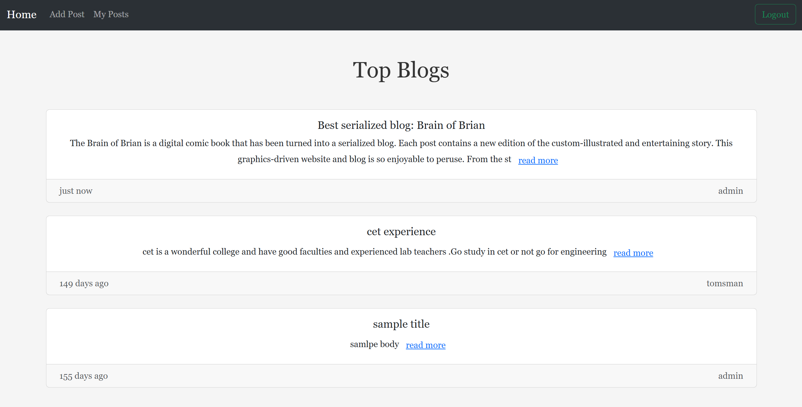

# BlogSpot



A simple and intuitive blogging platform for creating, managing, and sharing blog posts.

## Live Demo

Visit: [https://blogspot.mine.bz](https://blogspot.mine.bz)

## Features

- User authentication
- Create, edit, and delete blog posts
- Comment system

## Quick Start (Docker)

1. **Clone the repository:**
   ```sh
   git clone https://github.com/neevan0842/blogspot.git
   cd blogspot
   ```
2. **Create a `.env` file** in the root directory with your environment variables (see example in `docker-compose.yml`).
3. **Build and start all services:**
   ```sh
   docker-compose up --build
   ```
4. **Apply database migrations:**
   ```sh
   docker-compose exec backend python manage.py makemigrations
   docker-compose exec backend python manage.py migrate
   ```
5. **Access the app:**
   - Frontend: [http://localhost:5173](http://localhost:5173)
   - Backend API: [http://localhost:8000](http://localhost:8000)

---

## License

This project is licensed under the terms of the [LICENSE](./LICENSE).
